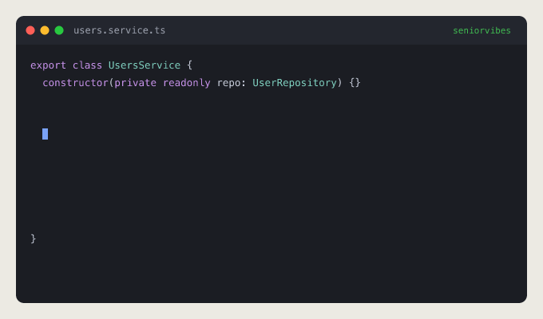

# seniorvibes

> Senior devs vibe coding.



A VS Code extension where a **one-line directive** becomes a small, reviewable,
correctly-grounded block of code — placed exactly where you asked for it. Control over magic.

Write a directive on its own line (or after existing code):

```ts
$# add a POST /users/:id/invite endpoint — validate body with InviteDto, call this.inviteService.send(), return 201, throw ConflictException if already invited
```

Press **Shift+Enter** (on the directive line) and the code is generated and inserted right
below it, grounded in the real symbols in your project. The directive then tidies itself away.

## Connect your models

Set `seniorvibes.provider`, and for the cloud ones run **`seniorvibes: Set API Key`** (keys go in
the OS keychain, never settings).

- **`anthropic`** — Claude. `anthropic.model` e.g. `claude-opus-4-8`, `claude-sonnet-4-6`, `claude-haiku-4-5`.
- **`openai`** — any OpenAI-compatible API via `openai.baseUrl`: OpenAI, OpenRouter, Groq, Together, Mistral, DeepSeek, LM Studio, vLLM.
- **`ollama`** (default) — local, no key: `ollama pull qwen2.5-coder`.

Privacy: `ollama` stays on your machine; `openai`/`anthropic` send the directive + context to that provider.

## How it works

- **Trigger** — type the sentinel `$#`, then your instruction. A `▶ seniorvibes: generate`
  CodeLens appears, or press **Shift+Enter** on the line. Both are scoped so normal editing
  is untouched.
- **Compound directives** — press **Enter** at the end of a directive to start another; adjacent
  directive lines are generated together. Multiple `$#` on one line each count as a directive.
- **Grounding** — symbols you name (`NotFoundException`, `inviteService`) are resolved through
  the language server and their real signatures are fed to the model, so references are correct,
  not hallucinated.
- **Clean output** — generated code is inserted with **no marker comments**. A re-run on a kept
  directive replaces the previous block instead of duplicating it.
- **Recent-code highlight** — freshly written code is briefly highlighted, then fades to normal.
- **Self-tidying directive** — after generation the directive line auto-removes (leaving only the
  code); rest your cursor on it to keep it for another iteration.

## Settings

| Setting | Default | Description |
|---|---|---|
| `seniorvibes.sentinel` | `$#` | Trigger token; may sit after existing code. Regex-escaped automatically. |
| `seniorvibes.provider` | `ollama` | Backend: `ollama`, `openai`, or `anthropic`. |
| `seniorvibes.ollama.endpoint` / `ollama.model` | `localhost:11434` / `qwen2.5-coder` | Local Ollama. |
| `seniorvibes.openai.baseUrl` / `openai.model` | `api.openai.com/v1` / `gpt-4o-mini` | OpenAI-compatible endpoint + model. |
| `seniorvibes.anthropic.baseUrl` / `anthropic.model` | `api.anthropic.com` / `claude-opus-4-8` | Anthropic API + Claude model. |
| `seniorvibes.context.linesAbove` / `linesBelow` | `40` / `10` | Lines of surrounding context sent. |
| `seniorvibes.grounding.enabled` | `true` | Resolve referenced symbols to real signatures via the LSP. |
| `seniorvibes.grounding.maxSymbols` | `8` | Max grounded signatures per generation. |
| `seniorvibes.highlight.style` | `foreground` | `foreground`, `background`, or `none`. |
| `seniorvibes.highlight.durationMs` | `5000` | How long the highlight holds before fading. |
| `seniorvibes.directive.removeAfterGenerate` | `true` | Auto-remove the directive after generating. |
| `seniorvibes.directive.removeDelayMs` | `5000` | Delay before removal (resets when the cursor leaves). |

## Known limitations

- A `$#` inside a string literal still triggers (we don't tokenize the line); explicit triggering
  keeps the harm low.
- Embedded languages (JS-in-HTML, etc.) use the host file's language.
